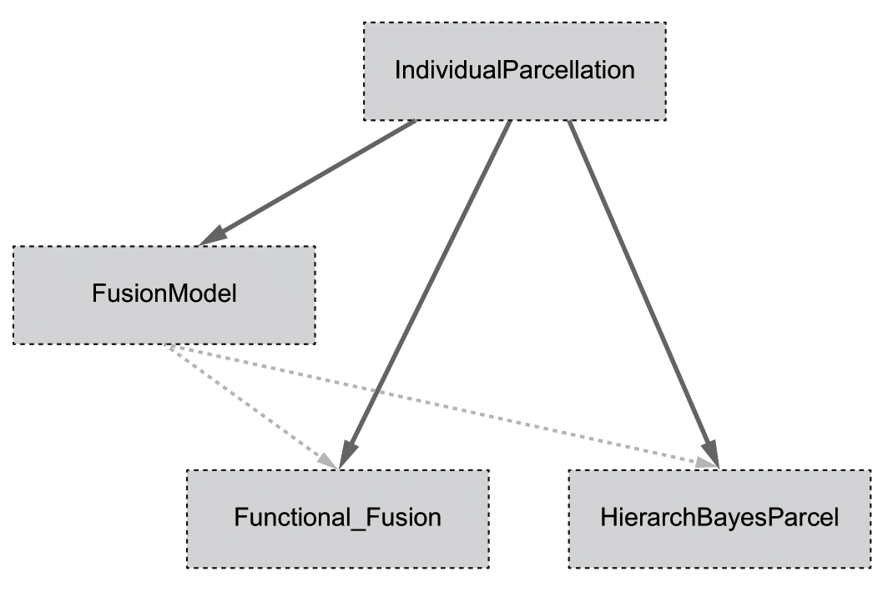

IndividualParcellation
====
This repository hosts a general pipeline to generate individual cerebellar parcellations under a 
hierarchical Bayesian brain parcellation framework
([HierarchBayesParcel](https://github.com/DiedrichsenLab/HierarchBayesParcel)) using individual 
localizing data. Mathematical details can be found in the 
[paper](https://www.biorxiv.org/content/10.1101/2023.05.24.542121v1).

Reference
------
If you use this pipeline, please cite the following paper:
* Zhi, D., Shahshahani, L., Nettekoven, C., Pinho, A. L. Bzdok, D., Diedrichsen, J., (2023). 
"A hierarchical Bayesian brain parcellation framework for fusion of functional imaging datasets". 
BioRxiv. [[link]](https://www.biorxiv.org/content/10.1101/2023.05.24.542121v1)

Dependencies
------
### Packages
This project depends on several third party libraries, including: [numpy](https://numpy.org/), 
[PyTorch](https://pytorch.org/), [nilearn](https://nilearn.github.io/stable/index.html),
[nibabel](https://nipy.org/nibabel/), and so on. Please find the `requirements.txt ` for more 
details and their version.

To successfully implement this pipeline, some packages from our group are also required, including 
[HierarchBayesParcel](https://github.com/DiedrichsenLab/HierarchBayesParcel), 
[Functional_Fusion](https://github.com/DiedrichsenLab/Functional_Fusion), 
[FusionModel](https://github.com/DiedrichsenLab/FusionModel), 
[SUITPy](https://suitpy.readthedocs.io/en/latest/index.html), and 
[nitools](https://nitools.readthedocs.io/en/latest/) packages. See the `READ.ME` in those repos 
for installation details.

### Calling structure
This pipeline is built on top of three basic packages: `HierarchBayesParcel`, `Functional_Fusion`,
and `FusionModel`. The `HierarchBayesParcel` package has all the basic functions of comptuational
modeling, including the model structure, the model fitting, and the model evaluation. The 
`Functional_Fusion` package has all the functions of data processing. The `FusionModel` package
hosts all the intermediate functions that connect the `HierarchBayesParcel` and the 
`Functional_Fusion` projects. The calling structure as shown below:

<div style="text-align:center">
  
</div>

### Installations

1. **General dependent packages** can be installed using pip:
    ```
    pip install -r requirements.txt 
    ```
    or you can install the package manually from their most updated binary distribution via pip 
    or conda by:
    ```
    pip install numpy matplotlib nibabel pandas torch SUITPy neuroimagingtools ...
    ```

2. **HierarchBayesParcel**, **Functional_Fusion**, and **FusionModel**:

    **MacOS/Linux**
    
    Once you have cloned these repository, you need to add their parent dir to your PYTHONPATH, so 
    you can import the functionality. Add these lines to your .bash_profile, .bash_rc .zsh_profile 
    file... 
    
    ```
    export PYTHONPATH=<abspath_of_repo_parentdir>:$PYTHONPATH
    ```
    **Windows**
    Add the parent dir of these repos to `Environment Variables...` -> `System variables`->`Path`
    in Windows System Properties setting. 


Individual parcellation pipeline
------
### 1. Load the atlas

### 2: Load the probabilistic group atlas from a _probseg.nii file

### Step 3: Build the arrangement model

### Step 4: Load the individual localizing data / info 

### Step 5: Compute the individual parcellations

### Step 6: Check the results / Visualization


Group map training
------


License
------
Please find out our development license (MIT) in `LICENSE` file.

Bug reports
------
Please contact Da Zhi at dzhi@uwo.ca if you have any questions about this repository.
